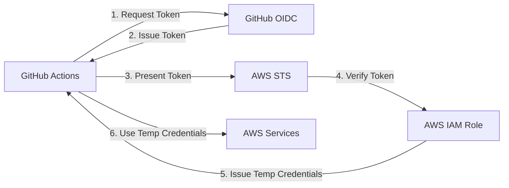

# Understanding OIDC vs Traditional AWS Authentication

## 🔐 **The Problem OIDC Solves**

### ❌ **Old Way (What you were doing):**
1. Store AWS Access Key + Secret Access Key in GitHub Secrets or AWS Secrets Manager
2. Use these long-term credentials in GitHub Actions
3. **Risk**: If compromised, attacker has persistent access

### ✅ **OIDC Way (Secure):**
1. GitHub Actions gets a temporary token from AWS
2. No long-term credentials stored anywhere
3. Token expires automatically (~1 hour)
4. **Benefit**: Zero persistent credentials = much more secure

## 📋 **What Goes Where**

### **GitHub Secrets** (Repository Settings):
```
AWS_ROLE_ARN: arn:aws:iam::123456789012:role/GitHubActions-MyRepo-Role
AWS_BUCKET_NAME: my-s3-bucket
AWS_CLOUDFRONT_DISTRIBUTION_ID: E1234567890123
SECRET_NAME: my-app-secrets
```

### **AWS Secrets Manager** (For Application Secrets Only):
```json
{
  "api_key": "your-third-party-api-key",
  "database_url": "postgresql://...",
  "jwt_secret": "your-signing-secret",
  "stripe_key": "sk_live_...",
  "email_api_key": "your-email-service-key"
}
```

### **❌ NEVER Store in AWS Secrets Manager with OIDC:**
```json
{
  "AWS_ACCESS_KEY_ID": "AKIA...",     // ❌ Don't do this!
  "AWS_SECRET_ACCESS_KEY": "...",     // ❌ Don't do this!
  "AWS_BUCKET_NAME": "my-bucket",     // ❌ Don't do this!
  "AWS_CLOUDFRONT_DISTRIBUTION_ID": "E123..." // ❌ Don't do this!
}
```

## 🔄 **How OIDC Authentication Works**



1. **GitHub Actions** requests an OIDC token
2. **GitHub** issues a signed token (contains repo info)
3. **AWS** verifies the token signature and repo/branch match
4. **AWS** issues temporary credentials (valid ~1 hour)
5. **GitHub Actions** uses temporary credentials to access AWS

## 🛡️ **Security Comparison**

| Feature | Traditional Keys | OIDC |
|---------|------------------|------|
| **Credential Storage** | GitHub Secrets | None required |
| **Credential Lifetime** | Permanent (until rotated) | ~1 hour |
| **Rotation Required** | Manual | Automatic |
| **Compromise Impact** | High (persistent access) | Low (expires quickly) |
| **Repository Access** | Any repo with secrets | Specific repo/branch only |
| **Audit Trail** | Limited | Full CloudTrail logs |

## 📝 **Your GitHub Secrets Should Only Have**

✅ **Infrastructure identifiers** (not credentials):
- `AWS_ROLE_ARN` - Which role to assume
- `AWS_BUCKET_NAME` - Which bucket to deploy to  
- `AWS_CLOUDFRONT_DISTRIBUTION_ID` - Which distribution to invalidate
- `SECRET_NAME` - Which secret contains your app secrets

✅ **Application secrets are retrieved at runtime** from AWS Secrets Manager:
- API keys for third-party services
- Database connection strings
- JWT signing secrets
- Payment processor keys

## ❓ **When to Use Each Approach**

### **Use OIDC When:**
- ✅ You have AWS resources (S3, CloudFront, etc.)
- ✅ You want maximum security
- ✅ You're using GitHub Actions for CI/CD
- ✅ You don't mind initial setup complexity

### **Use Traditional Keys When:**
- ⚠️ You're using non-AWS CI/CD platforms
- ⚠️ You need to support legacy systems
- ⚠️ You can't modify IAM configurations

## 🎯 **Bottom Line**

With OIDC properly configured:
- **No AWS credentials stored anywhere**
- **Automatic security** through short-lived tokens
- **AWS handles everything** - you just specify which role to use

The whole point is to eliminate long-term credentials entirely! 